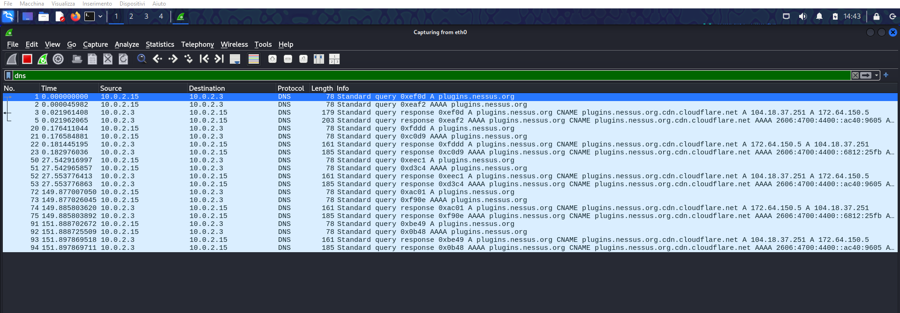

# 🔍 Analisi del traffico DNS con Wireshark su Kali Linux

Questa guida documenta passo per passo le operazioni svolte per catturare e analizzare il traffico DNS con **Wireshark** su una macchina **Kali Linux**.

## 📌 Prerequisiti

- Kali Linux installato su VirtualBox
- **Wireshark** installato e funzionante
- Connessione di rete attiva

---

## 🏁 Avvio della cattura del traffico

1. **Aprire Wireshark**
   - Dalla barra delle applicazioni di **Kali Linux**, avviare **Wireshark**.

2. **Selezionare l'interfaccia di rete**
   - Cliccare sull'interfaccia di rete attiva (in questo caso `eth0`).
   - Avviare la cattura cliccando su **Start Capture** (icona verde ▶️).

   

---

## 🎯 Filtrare il traffico DNS

3. **Inserire il filtro DNS**
   - Nella barra dei filtri, digitare:
     ```
     dns
     ```
   - Premere **Invio** per applicare il filtro.

   

---

## 🔍 Analisi di un pacchetto DNS

4. **Selezionare un pacchetto DNS di risposta**
   - Nella lista dei pacchetti, scegliere una riga con protocollo **DNS** e tipo **response**.
   - Espandere il livello **Domain Name System (response)**.

   

---

## 🧩 Esaminare il record DNS

5. **Individuare i dettagli del pacchetto**
   - **Transaction ID:** identifica la richiesta e risposta associata.
   - **Flags:** mostra se è una risposta e se ci sono errori.
   - **Query Name:** il dominio richiesto.
   - **Answers:** contiene il valore risolto, ad esempio:
     ```
     plugins.nessus.org -> plugins.nessus.org.cdn.cloudflare.net
     ```
   

---

## ⏳ Analisi del Time To Live (TTL)

6. **Osservare il valore TTL**
   - Indica per quanto tempo il record può essere considerato valido.
   - Ad esempio:
     ```
     Time to live: 242 (4 minuti, 2 secondi)
     ```
   - Più il valore è basso, più spesso il client deve fare una nuova richiesta.

   

---

## 🌐 Differenza tra Record A e AAAA

7. **Analisi del tipo di risposta**
   - **Record A:** restituisce un indirizzo **IPv4**.
   - **Record AAAA:** restituisce un indirizzo **IPv6**.
   - In questo esempio, vediamo un **record AAAA** con indirizzi IPv6.

   

---

## ✅ Conclusione

In questo laboratorio abbiamo:
- Catturato e filtrato traffico **DNS** con **Wireshark**.
- Analizzato la struttura di una richiesta e risposta DNS.
- Identificato il valore **TTL** e il significato dei **record A e AAAA**.

Questo tipo di analisi è utile per:
- **Diagnosticare problemi di rete**
- **Analizzare attacchi di DNS spoofing**
- **Monitorare il comportamento del traffico Internet**.

---

🚀 **Fine della guida!**
