# 📌 Esercitazione S11L5: 🔍 Analisi e Attacco con Strumenti di Cybersecurity

## 🛠️ Introduzione
Questa esercitazione esplora l'uso di strumenti di cybersecurity per **analizzare e monitorare** attività di rete.  
Verranno utilizzati:  
🔹 **PowerShell**  
🔹 **Wireshark**  
🔹 **Nmap**  
🔹 **Analisi attacchi SQL Injection su MySQL**  

---

## ⚡ Windows PowerShell: Diagnostica & Automazione  
PowerShell è una piattaforma di **automazione e gestione** per sistemi Windows e cloud.  

### 📌 Comandi utilizzati  

✅ **Ping per verifica connessione di rete**  
```powershell
ping google.com
```
📸 **Screenshot**  


✅ **Visualizzazione file e directory**  
```powershell
dir
```
📸 **Screenshot**  
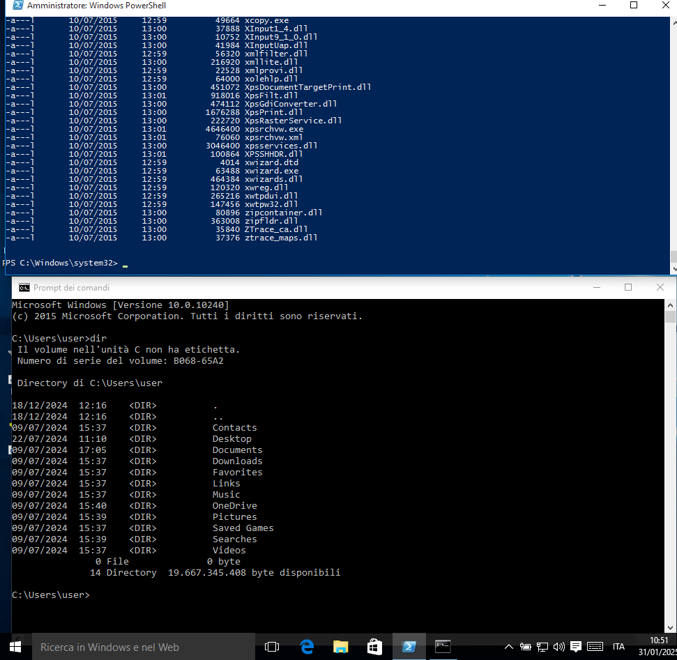

✅ **Navigazione tra cartelle**  
```powershell
cd C:\Users
```
📸 **Screenshot**  
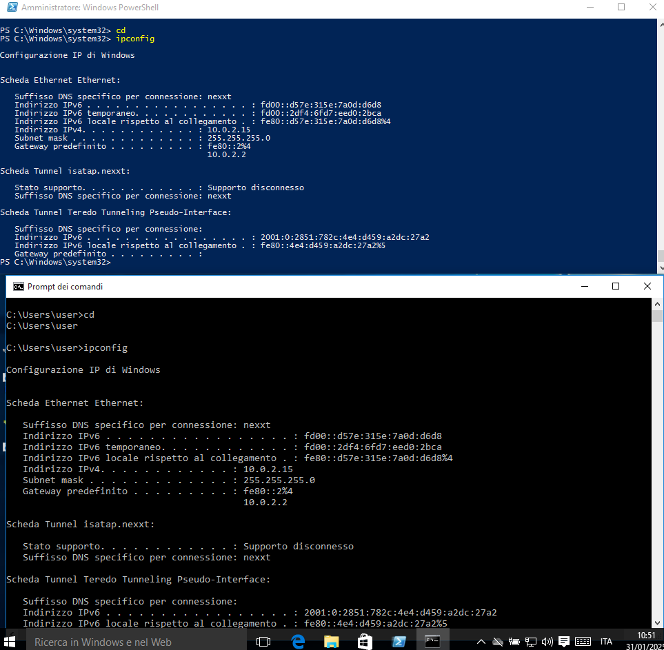

✅ **Visualizzazione della configurazione di rete**  
```powershell
ipconfig
```
📸 **Screenshot**  
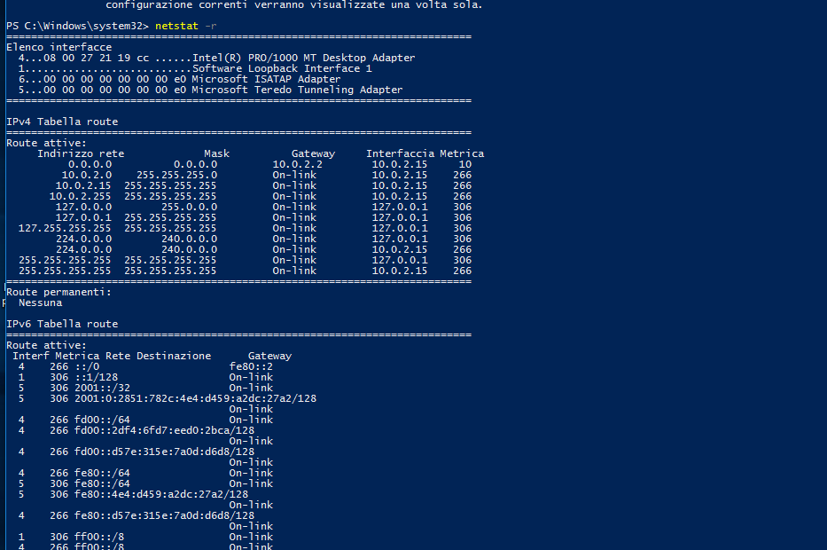

✅ **Monitoraggio della tabella di routing**  
```powershell
netstat -r
```
📸 **Screenshot**  
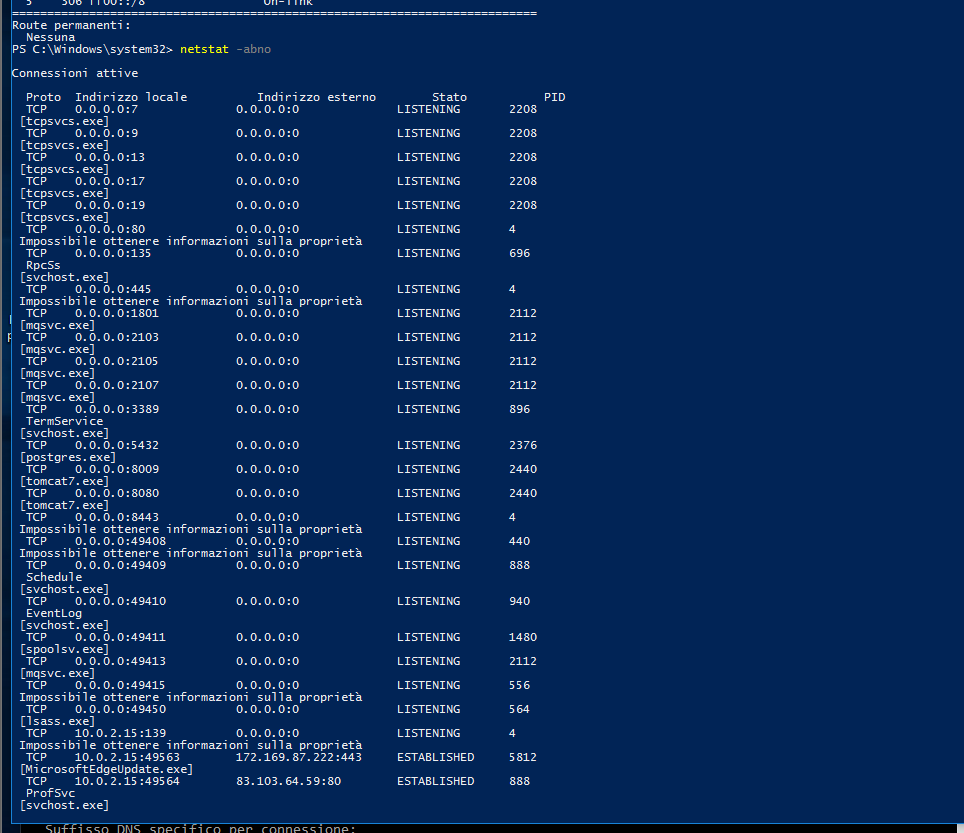

✅ **Visualizzazione delle connessioni di rete attive con dettagli sui processi**  
```powershell
netstat -abno
```
📸 **Screenshot**  


✅ **Svuotare il Cestino**  
```powershell
Clear-RecycleBin
```
📸 **Screenshot**  
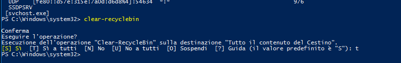

---

## 🌐 Wireshark: Analisi del traffico HTTP & HTTPS  
Wireshark è uno **strumento essenziale** per l'analisi dei pacchetti di rete.  
Qui analizzeremo il traffico HTTP e HTTPS per osservare le **differenze di sicurezza**.

### 📌 Passaggi eseguiti  

✅ **Cattura del traffico HTTP**  
```bash
sudo tcpdump -i enp0s3 -s 0 -w httpdump.pcap
```
📸 **Screenshot**  
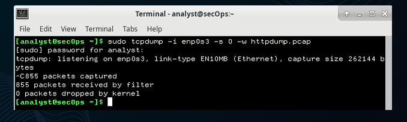

✅ **Apertura della cattura in Wireshark e applicazione del filtro HTTP**  
```
http
```
📸 **Screenshot**  
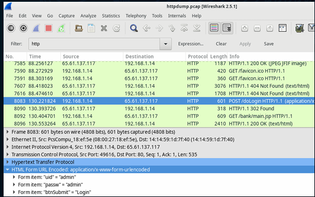

✅ **Ripetizione della cattura con traffico HTTPS**  
```bash
sudo tcpdump -i enp0s3 -s 0 -w httpsdump.pcap
```
📸 **Screenshot**  


✅ **Analisi della crittografia TLS**  
```
tls
```
📸 **Screenshot**  
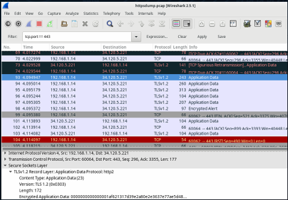

---

## 🎯 Nmap: Scansione di rete  
Nmap è uno **strumento avanzato** per la scansione di reti, utile per identificare **porte aperte e servizi attivi**.

### 📌 Tipologie di scansioni eseguite  

✅ **Scansione del localhost (127.0.0.1)**  
```bash
nmap -A -T4 localhost
```
📸 **Screenshot**  
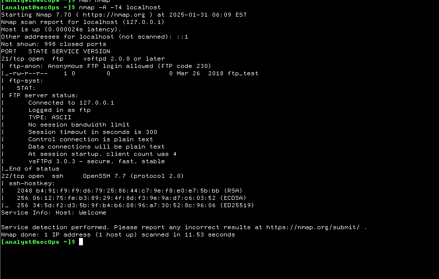

✅ **Scansione di una rete IP per elencare dispositivi e porte aperte**  
```bash
nmap -sn 192.168.1.0/24
```
📸 **Screenshot**  
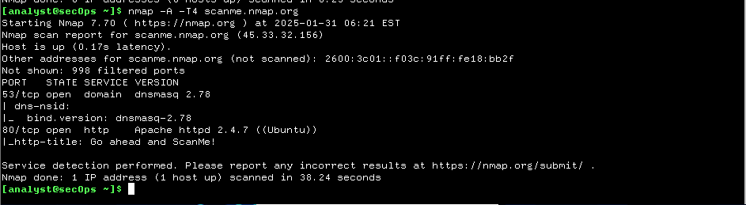

✅ **Scansione di un server remoto con identificazione dettagliata**  
```bash
nmap -A -T4 scanme.nmap.org
```
📸 **Screenshot**  


---

## 🔥 Wireshark: Analisi di un attacco SQL Injection  
Questa sezione analizza il traffico relativo a un attacco **SQL Injection** contro un database **MySQL**.

### 📌 Passaggi eseguiti  

✅ **Identificazione degli IP coinvolti (attaccante e server).**  
📸 **Screenshot**  


✅ **Apertura della conversazione HTTP Stream per osservare l’invio della query malevola.**  
📸 **Screenshot**  


✅ **Uso del payload `1=1` per verificare la vulnerabilità.**  

✅ **Query per ottenere il nome del database:**  
```sql
SELECT database();
```
📸 **Screenshot**  


✅ **Estrazione delle tabelle disponibili:**  
```sql
SELECT table_name FROM information_schema.tables;
```
📸 **Screenshot**  
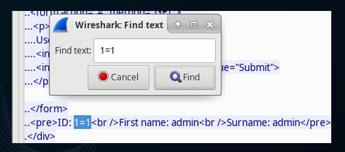

✅ **Recupero di username e hash delle password:**  
```sql
SELECT username, password FROM users;
```
📸 **Screenshot**  
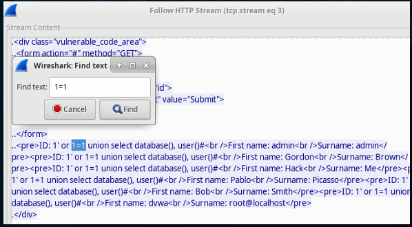

---

## 🚀 Conclusioni  
Questa esercitazione ha mostrato come:

✅ **PowerShell** può essere usato per il monitoraggio e la diagnostica di sistema.  
✅ **Wireshark** permette di intercettare traffico HTTP e analizzare vulnerabilità.  
✅ **Nmap** è essenziale per mappare reti e identificare servizi esposti.  
✅ **Analizzare gli attacchi SQL Injection** aiuta a comprendere le minacce ai database.  

🔐 **Proteggi sempre la tua rete e approfondisci la cybersecurity!** 🔥

📌🚀 **Buon lavoro!** 🎯