# Progetto: Shell PHP per Controllo Remoto su Metasploitable

## 🎯 Obiettivo
Creare e utilizzare una shell PHP per ottenere il controllo remoto completo della macchina Metasploitable e intercettare le richieste mediante BurpSuite.

## 📚 Introduzione
Questo progetto dimostra l'efficacia dell'utilizzo di una shell PHP per acquisire controllo completo su un sistema vulnerabile. Attraverso la shell, è possibile:

- ✅ Eseguire comandi remoti, simulando un'interazione diretta con il terminale della macchina.
- ✅ Navigare liberamente nel file system.
- ✅ Caricare e scaricare file.
- ✅ Interagire con strumenti terminali, come l'editor di testo nano.

## ⚙️ Requisiti
- **Macchine Virtuali:**
  - Kali Linux: 192.168.50.100
  - Metasploitable: 192.168.50.101
- **Strumenti:**
  - PHP preinstallato su Metasploitable.
  - Browser web su Kali Linux.
  - BurpSuite per l'analisi delle richieste HTTP.
- **File richiesto:**
  - `shell.php` (incluso nel progetto).

## 📂 Passaggi Eseguiti
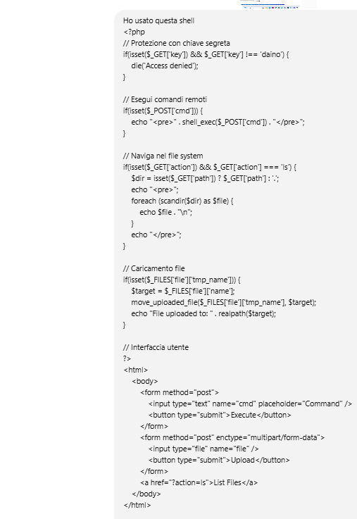
### 1️⃣ Configurazione dell'Ambiente
- 🌐 **Connessione tra Kali e Metasploitable:**
  - Configurate le macchine per comunicare tra loro.
  - Test di connettività eseguito con comando: `ping 192.168.50.101`
  - 🔁 **Risultato:** Connettività confermata.
- 🔒 **Accesso alla DVWA su Metasploitable:**
  - Accesso alla web app vulnerabile tramite: `http://192.168.50.101/dvwa`
  - Impostazione del livello di sicurezza su 'Low' per facilitare l'upload della shell.

### 2️⃣ Caricamento della Shell
- 🖋️ **Creazione della shell shell.php:**
  - Implementazione di funzionalità avanzate per l'esecuzione di comandi e la navigazione nel file system.
  - **Codice completo fornito in appendice.**
- 📤 **Upload della shell su DVWA:**
	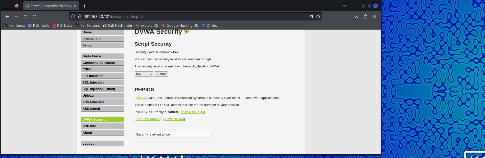
	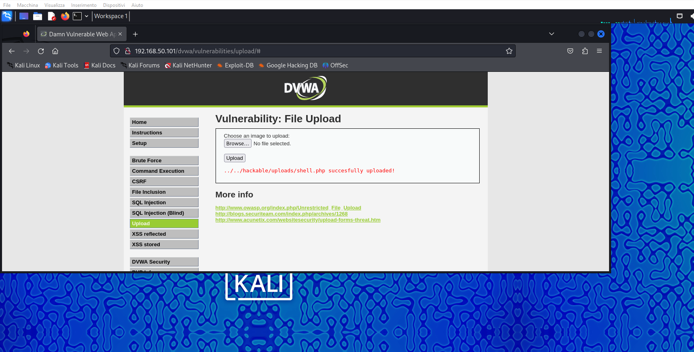
  - Caricamento del file attraverso la sezione File Upload.
  - **Test di caricamento:** Accesso alla shell tramite browser a 
    `http://192.168.50.101/dvwa/hackable/uploads/shell.php?key=mysecretkey`
- 🔑 **Accesso protetto alla shell:**
  - Utilizzo della chiave `mysecretkey` per garantire l'accesso controllato alla shell.

### 3️⃣ Utilizzo della Shell
- ⚡ **Esecuzione di Comandi Remoti:**
  - Esempi di comandi eseguiti: `ls`, `whoami`, `tree -a`
- 🗂️ **Navigazione del File System:**
  - Comandi come `cd /var/www/html` per la navigazione.
  - Navigazione persistente grazie alla gestione delle sessioni.
- 🛠️ **Interazione con Strumenti:**
  - Utilizzo di `nano` per modificare file in modalità interattiva.

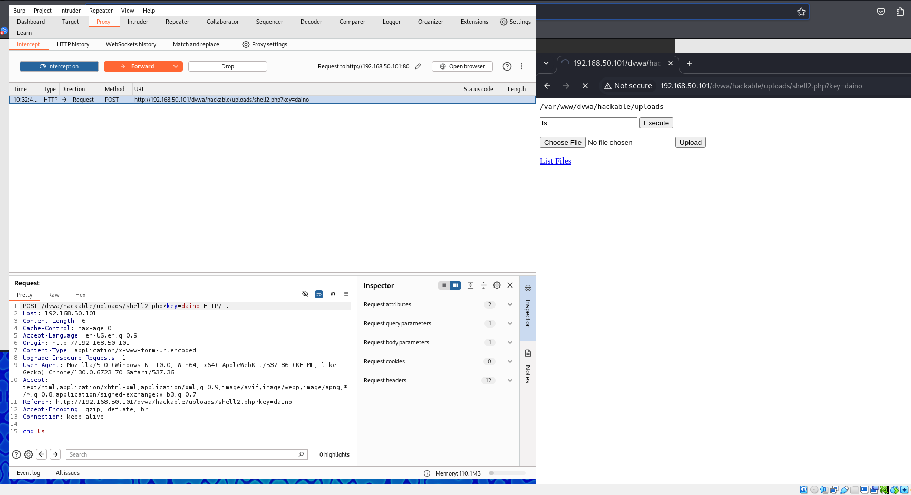
### 4️⃣ Intercettazioni con BurpSuite
- 🛠️ **Configurazione di BurpSuite:**
  - Configurazione per intercettare il traffico HTTP.
- 🔎 **Intercettazione delle Richieste HTTP:**
  - Analisi dettagliata delle richieste con inclusione di screenshot delle interazioni più significative.

## 📷 Screenshot
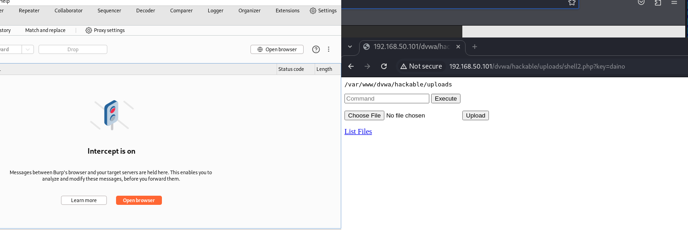
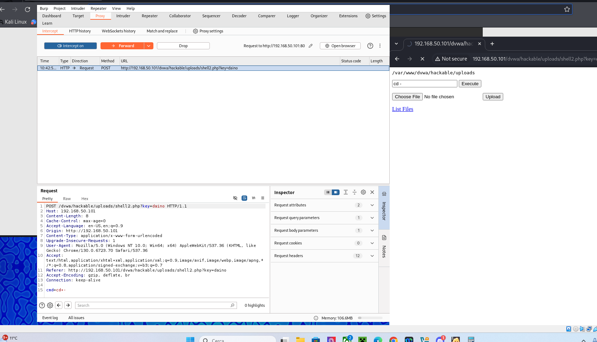

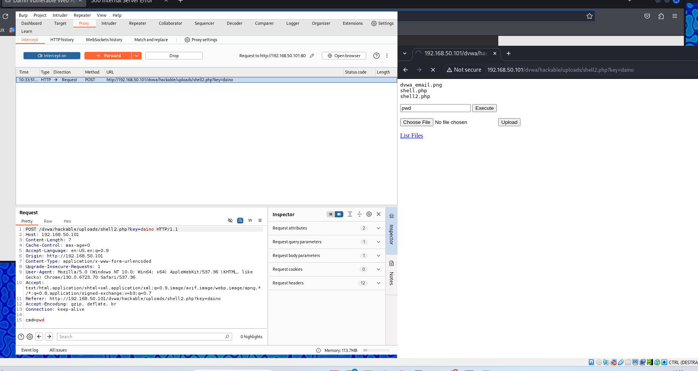
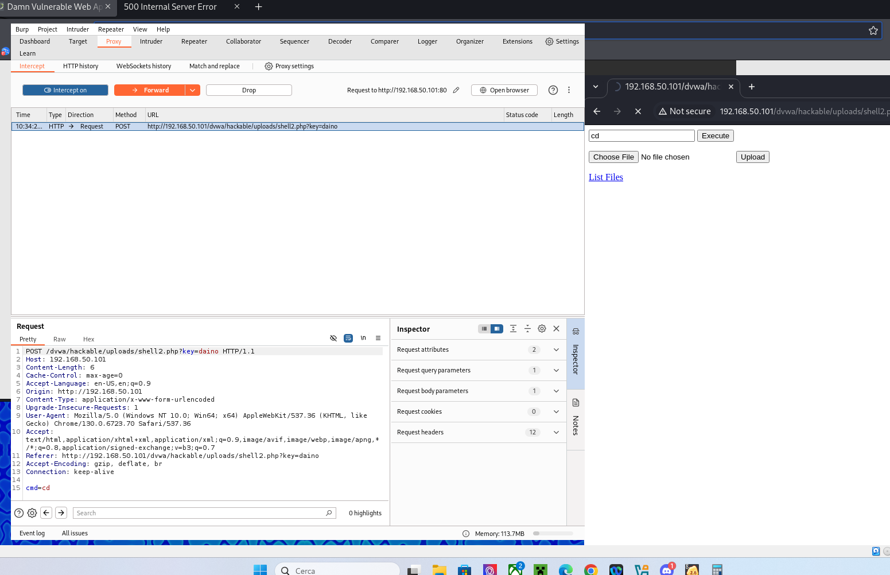
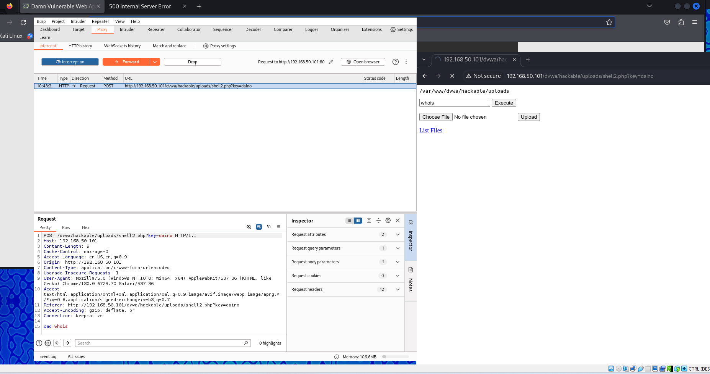
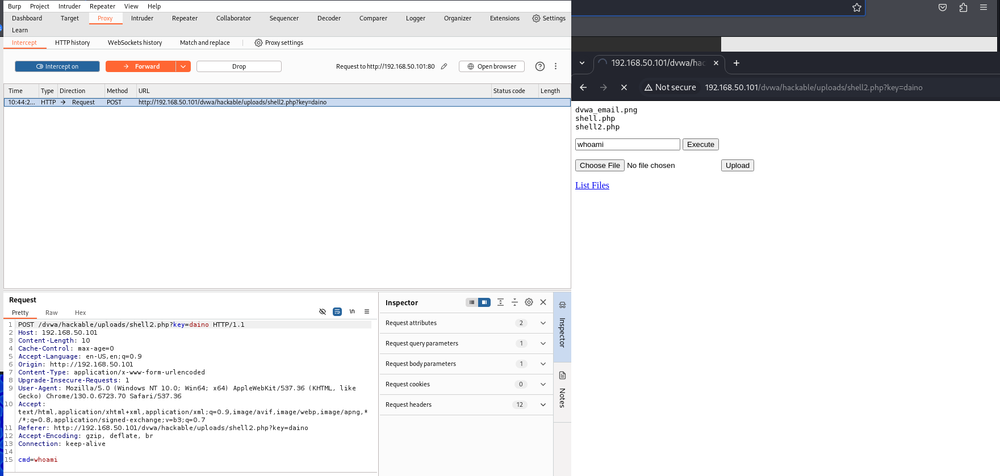
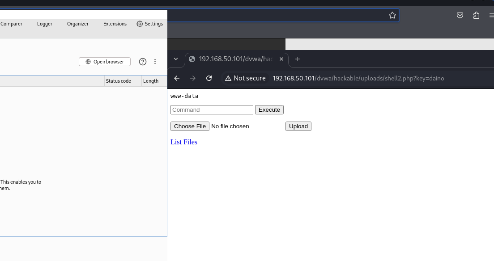
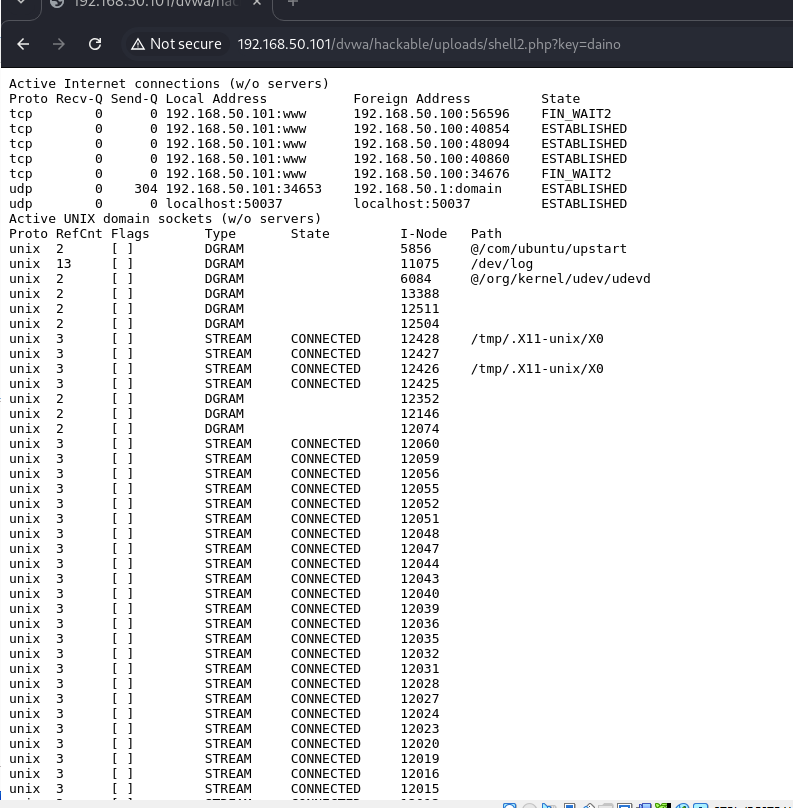

---
