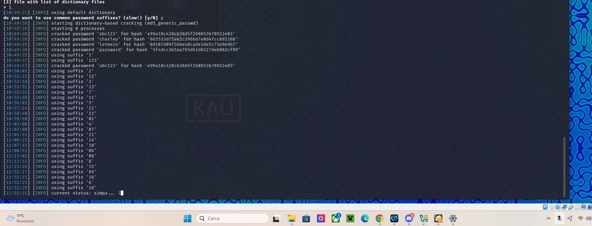

# Relazione sull’Esercizio di Password Cracking e Vulnerabilità XSS

## Contesto dell’Esercizio
L’obiettivo principale dell’attività è stato quello di:

- Creare un ambiente controllato utilizzando **Kali Linux** e la **Damn Vulnerable Web Application (DVWA)** per l’esecuzione di test di sicurezza su vulnerabilità note.
- Eseguire un attacco **XSS (Cross-Site Scripting)** riflesso per ottenere i cookie della sessione.
- Utilizzare **SQLMap** per eseguire attacchi **SQL Injection** ed estrarre dati sensibili dal database.
- Eseguire il cracking degli hash delle password estratti utilizzando attacchi basati su dizionari.

---

## Configurazione dell’Ambiente

### Ambiente Operativo
- **Sistema Operativo:** Kali Linux
- Installazione degli strumenti necessari per condurre test di sicurezza (DVWA, Metasploit, browser configurato per i test).

### DVWA
- Accesso all’applicazione **DVWA**.
- Configurazione del livello di sicurezza su **Low** per consentire test facilitati su vulnerabilità conosciute.

### Rete
- Ambiente locale e protetto con indirizzo IP dedicato: **192.168.50.101**.

---

## Attacco XSS Riflesso

### Preparazione dell’Attacco
- Individuata la pagina vulnerabile all'interno della sezione **XSS Reflected** di DVWA.
- Inserito il seguente payload nello spazio predisposto per l'input utente:
  ```html
  <script>alert(document.cookie)</script>
  ```

### Esecuzione
- Una volta inviato il payload, il codice JavaScript inserito è stato eseguito dal browser, generando un alert contenente i cookie di sessione attivi.

### Risultato
- **Cookie ottenuto:**
  ```
  bbdc17506d459d454f89af19adf92214
  ```
- Questo cookie rappresenta la sessione utente e potrebbe essere usato in un attacco di **session hijacking**, se non adeguatamente protetto da misure di sicurezza (es. flag `HttpOnly`).

---

## Attacco SQL Injection con SQLMap

### Preparazione
- Dopo aver ottenuto il cookie tramite XSS, è stato utilizzato per autenticare una sessione durante l’attacco SQL Injection.

### Comando Utilizzato
```bash
sqlmap -u "http://192.168.50.101/dvwa/vulnerabilities/sqli/?id=1&Submit=Submit" --cookie="PHPSESSID=bbdc17506d459d454f89af19adf92214; security=low" -D dvwa -T users -C user,password --dump
```

### Esecuzione
- SQLMap ha automatizzato il processo di SQL Injection, autenticandosi con il cookie della sessione e accedendo al database.
- La query ha estratto dati dalla tabella `users`, in particolare le colonne `user` e `password`.

### Risultato
- I dati estratti contengono username e hash delle password degli utenti presenti nella tabella `users`. Questi hash sono stati successivamente utilizzati per sessioni di cracking.

---

## Cracking delle Password Estratte

### Preparazione
- Utilizzando gli hash estratti, è stato avviato un processo di cracking basato su dizionario.

### Risultati
- Password decifrate:
  - `abc123`
  - `charley`
  - `letmein`
  - `password`

---

## Screenshots e Allegati

1. **Richiesta cookie (XSS Reflected):**
   - Mostra il risultato del payload XSS con l'alert contenente i cookie della sessione attiva.
   

2. **Avvio di SQLMap:**
   - Screenshot che illustra il comando SQLMap e la verifica iniziale dei parametri vulnerabili all’SQL Injection.
   

3. **Verifica e test SQLMap:**
   - Mostra i vari test effettuati per determinare la vulnerabilità e identificare il backend MySQL.
   

4. **Cracking delle password:**
   - Mostra il processo di cracking degli hash utilizzando un dizionario e suffissi comuni.
   

5. **Progresso del cracking:**
   - Dettagli sullo stato avanzato del cracking delle password con suffissi specifici.
   

6. **Risultati finali:**
   - Elenco delle password decifrate con username associati, esportati in un file CSV.
   

---

## Considerazioni e Passi Successivi

### Vulnerabilità Identificate
- La mancanza di filtraggio dei dati di input consente l’esecuzione di codice JavaScript arbitrario (**XSS riflesso**).
- La vulnerabilità **SQL Injection** permette accesso non autorizzato a dati sensibili nel database.
- Password non sicure o deboli sono facilmente craccabili tramite attacchi basati su dizionari.

### Possibili Contromisure
- Validazione e sanitizzazione degli input utente per prevenire XSS e SQL Injection.
- Configurazione di HTTP Headers, come `Content-Security-Policy`, per prevenire l’esecuzione di script non autorizzati.
- Uso di parametri preparati (**prepared statements**) e ORM (**Object-Relational Mapping**) per interazioni sicure con il database.
- Educazione degli utenti sull’importanza di utilizzare password sicure.

### Prossimi Passi
- Analizzare ulteriormente le vulnerabilità sfruttate e documentare possibili mitigazioni.
- Utilizzare strumenti di penetration testing avanzati per identificare altre potenziali falle.

---

## Conclusioni
Questo esercizio ha dimostrato l’importanza di mitigare vulnerabilità comuni come **XSS** e **SQL Injection** nelle applicazioni web. Le tecniche utilizzate hanno mostrato quanto sia critica la protezione di cookie di sessione e database sensibili. Inoltre, l’analisi delle password craccate ha evidenziato l’importanza di utilizzare password complesse e robuste. Le attività sono state eseguite in un ambiente controllato e a scopo educativo.
