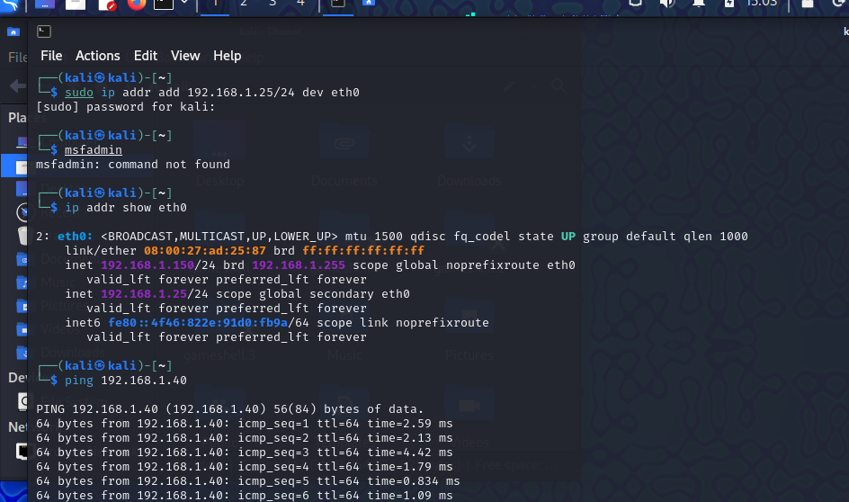
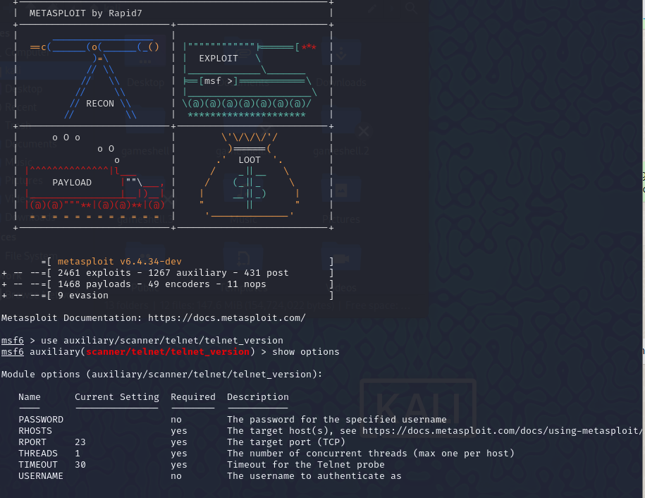
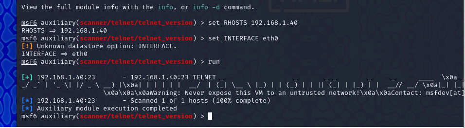

# 🚀 **Esercitazione: Utilizzo di Metasploit per analisi Telnet sulla macchina Metasploitable**

## 🎯 **Obiettivo**
Sfruttare il modulo `auxiliary/scanner/telnet/telnet_version` di Metasploit per ottenere informazioni sulla versione del servizio Telnet attivo sulla macchina **Metasploitable**.

---

## 🌐 **Configurazione della rete**
- 💻 **Kali Linux (attaccante):** IP = `192.168.1.25`
- 🖥️ **Metasploitable (bersaglio):** IP = `192.168.1.40`

---

## 🛠️ **Passaggi**

### 1️⃣ **Configurazione dell'IP statico sulla macchina Kali Linux**
💡 Esegui i seguenti comandi per configurare l'indirizzo IP su Kali Linux:

```bash
sudo ip addr add 192.168.1.25/24 dev eth0
sudo ip link set eth0 up
```
✅ Verifica la configurazione:
```bash
ip addr show eth0
```

---

### 2️⃣ **Configurazione dell'IP statico sulla macchina Metasploitable**
💡 Accedi alla macchina Metasploitable e configura l'indirizzo IP:

```bash
ifconfig eth0 192.168.1.40 netmask 255.255.255.0 up
```
✅ Verifica la configurazione:
```bash
ifconfig
```

---

### 3️⃣ **Test della connettività tra le macchine**
🔎 Dalla macchina Kali, verifica che la macchina Metasploitable sia raggiungibile:

```bash
ping 192.168.1.40
```

---

### 4️⃣ **Avvio di Metasploit Framework**
🚀 Apri la console di Metasploit con il comando:

```bash
sudo msfconsole
```

---

### 5️⃣ **Caricamento del modulo `telnet_version`**
🔧 Carica il modulo per scansionare la versione di Telnet:

```bash
use auxiliary/scanner/telnet/telnet_version
```
📋 Visualizza le opzioni del modulo:

```bash
show options
```

---

### 6️⃣ **Configurazione dei parametri del modulo**
🔑 Imposta l'indirizzo IP del target:

```bash
set RHOSTS 192.168.1.40
```
▶️ Esegui il modulo:

```bash
run
```

---

### 7️⃣ **Output del modulo**
📊 L'output mostrerà la versione del servizio Telnet attivo sulla macchina Metasploitable. Esempio:

```
[+] 192.168.1.40:23 - Telnet Server Version: "Linux telnetd 0.17"
[*] Scanned 1 of 1 hosts (100% complete)
[*] Auxiliary module execution completed
```

---

## 🎉 **Conclusione**
Abbiamo utilizzato con successo il modulo `telnet_version` di Metasploit per identificare la versione del servizio Telnet in esecuzione sulla macchina Metasploitable. Questo tipo di analisi è utile per individuare vulnerabilità sfruttabili su servizi obsoleti o non configurati correttamente.

---

## 🖼️ **Screenshot**
1. 📸 Configurazione IP
2. 📸 Utilizzo di Metasploit
3. 📸 Output del modulo
 

 




---

⚠️ **Nota:** Assicurarsi di utilizzare la rete in un ambiente sicuro e controllato (sandbox o VM isolate) per evitare rischi di sicurezza. 🛡️
